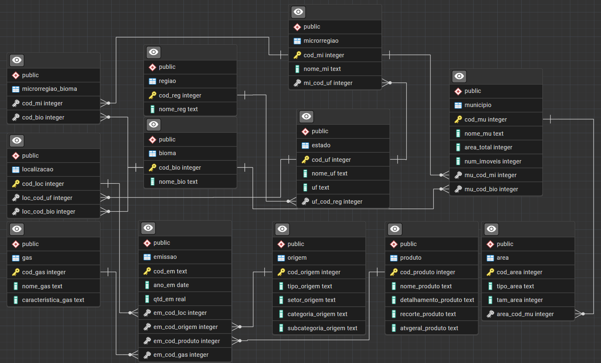
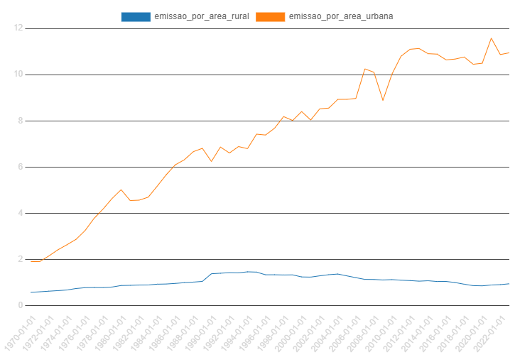
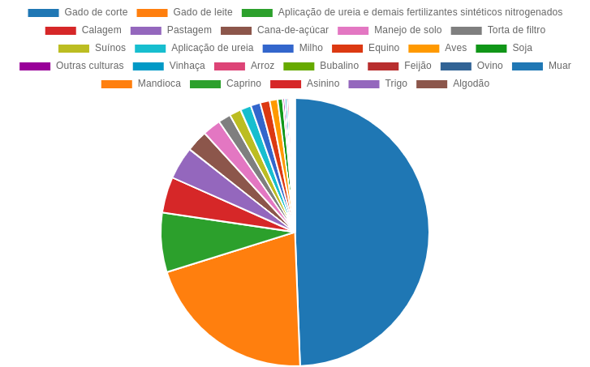
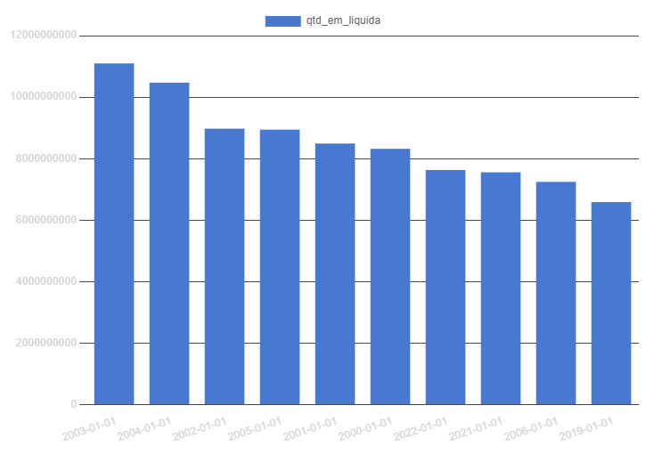

# MC536 - Projeto 1 – Banco de Dados: Análise das emissões de gases do efeito estufa no Brasil a fim de promover uma agricultura sustentável

## Sumário
* [Sobre o projeto](#sobre-o-projeto)
* [Modelagem do Banco de Dados](#modelagem-do-banco-de-dados)
* [Tecnologias utilizadas](#tecnologias-utilizadas)
* [Datasets](#datasets)
* [Consultas Geradas](#consultas-geradas)
* [Resultados](#resultados)

## Sobre o projeto
Autores:
* [Luiz Felipe Lenharo](https://github.com/luizlenharo) (237896)
* [Henrique Cazarim Meirelles Alves](https://github.com/cazarimh) (244763)
* [Gustavo Marcelino Rodrigues](https://github.com/gustavomrodrigues) (238183)

 Esse projeto foi desenvolvido durante a disciplina MC536 - Banco de Dados: Teoria e Prática. O objetivo deste projeto consiste em idealizar um banco de dados relacional utilizando datasets distintos e realizar consultas não triviais neste banco. A realização do projeto se baseou nas ODS 2 (Fome zero e agricultura sustentável) e ODS 13 (Ação contra a mudança global do clima), escolhemos datasets que mostram emissões de GEE no Brasil e preservação de áreas das cidades do Brasil.
 A partir do banco de dados resultante do projeto é possível acessar informações sobre as emissões, como a quantidade emitida (de 1970 a 2023), a localização (estado e bioma) em que ocorreu e caracterização (setor, categoria, produto, etc.), além de dados sobre a divisão do tipo de área de cada município brasileiro (com área total, preservada, protegida e rural). As consultas geradas são a respeito dos GEE no Brasil provenientes principalmente de atividades agrícolas, como descrito nas seções seguintes.

## Modelagem do Banco de Dados
### Imagem 1: Modelo Conceitual (Diagrama MER)

  

### Imagem 2: Modelo Relacional

  

 O [Modelo Físico](./models/modeloFisico) foi gerado a partir do Modelo Relacional com a ferramenta do pgAdmin4 e foi implementado em Python para a [definição das tabelas e relacionamentos](./models/dbDefinition.py) do banco de dados.

## Tecnologias utilizadas
* **Banco de dados:** `PostgreSQL`  
* **Linguagem de Programação:** `Python`  
* **Bibliotecas:** `pandas, psycopg2`  
* **Ferramentas de modelagem**: `pgAdmin4`

## Datasets
### SEEG (Sistema de Estimativas de Emissões e Remoções de Gases de Efeito Estufa)
* Os dados estão diretamente atrelados aos setores de Processos Industriais e Resíduos, Mudança de uso da Terra, Energia e Agropecuária.
* A plataforma do [`SEEG`](https://seeg.eco.br/dados/) disponibiliza dados detalhados sobre emissão por município, estado, região e setor.
* O SEEG é fundamental para o monitoramento das mudanças climáticas e construção de medidas políticas voltadas para a redução da emissão dos gases de efeito estufa (GEE).

### EMBRAPA (Empresa Brasileira de Pesquisa Agropecuária)
* Os dados estão diretamente relacionados com as áreas preservadas do Brasil, sendo elas:
    * Área total do município
    * Número de propriedades rurais
    * Áreas protegidas (conservação, índigena e militar)
    * Áreas preservadas (destinadas a preservação vegetal em propriedade rural)

* A [`EMBRAPA`](https://geoinfo.dados.embrapa.br/metadados/srv/por/catalog.search#/metadata/61e66efd-7757-4d78-84b9-c3047a8bbc70) realiza e desenvolve pesquisas e tecnologias direcionadas à gestão sustentável de recursos naturais e o desenvolvimento sustentável.
* Alguns dos dados referentes às áreas neste dataset estão incongruentes. Notamos que alguns estão multiplicados por potência de 10 porém sem um padrão específico e não encontramos documentação que especificasse ou explicasse o motivo. Portanto, consultas geradas com dados referentes às áreas podem não refletir a realidade.

### Pré-Processamento 
#### SEEG
1. Deixamos apenas a página da planilha de dados.
2. Selecionamos apenas as colunas referentes à origem, produto, gás e localização.
3. Salvamos a planilha resultante em [`gasesEE-entidades.csv`](./dataset/gasesEE-entidades.csv)
4. Retornamos para a planilha original (planilha de dados).
5. Separamos a planilha de dados em 4 chunks de tamanho semelhante.
6. Salvamos cada uma das partes em [`gasesEE-medicoes_Ci.csv`](./dataset), sendo i o número de cada chunk

#### EMBRAPA
1. Excluimos as colunas A, B, C, D, H, W, X e Y pois que possuíam informações desnecessárias para nossa utilização.
2. Salvamos a planilha resultado em [cidadesPreserv.csv](./dataset/cidadesPreserv.csv)

#### SCRIPT
1. Utilizamos as planilhas resultantes para popular o banco

## Consultas Geradas
Para realizar a análise dos dados foram feitas cinco consultas não triviais em SQL, listadas abaixo:
1. Porcentagem da emissão da agropecuária sobre emissão total em um estado em determinado ano.

2. Evolução da (emissão agropecuária/área rural) e (emissão indústria/área urbana) ao longo dos anos.

3. Aumento da emissão de gases em São Paulo e nos outros estados no período de 1970 - 2023 e comparação entre aumento de SP e média dos outros estados.   Obs:
 Aumento relativo mostra a intensidade do crescimento de São Paulo em relação ao resto do Brasil

4. Porcentagem de emissão dos top 5 produtos mais emissores na agropecuária.

5. Top 10 anos com maior balanço *qtd_em* + *qtd_rem* no século 21.

O código delas se encontra [aqui](./querys/). As consultas também foram implementadas em Python e podem ser encontradas [aqui](./querys/querys.py).
## Resultados
Executando as consultas listadas acima, obtivemos os resultados presentes no diretório [/results](./results/), onde cada subdiretório contem o arquivo `.csv` resultante da consulta e os gráficos gerados (apenas nas consultas 2, 4 e 5). Abaixo estão os gráficos. 

* **Gráfico Query 2**: 

  

 

* **Gráfico Query 4**:

  

 

* **Gráfico Query 5**:

  

